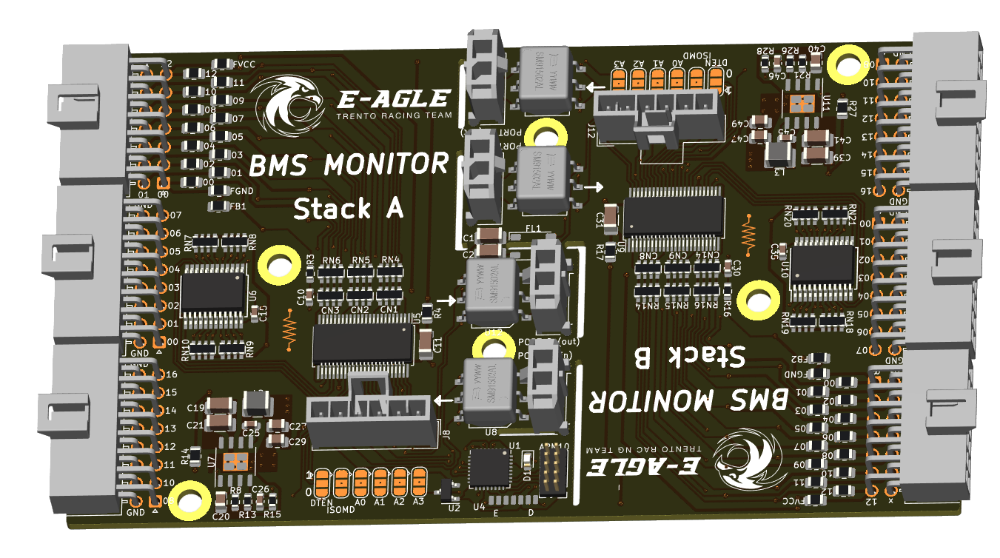

# BMS Monitor

Slave BMS module to monitor 24s cells voltages and temperatures.

## Contributors

_Latest first_

- Filippo Volpe

## Features

- 24 cells series
- 32 temperature measurements
- LTC6811-1/-2 both are compatible
- isoSPI cost effective communication interface to the monitor IC directly
- cell balancing
- STM32L0 can be fitted to add logic to the board by itself
- IRda optional communication to the MCU
- compatible, for temperatures, with both NTC and shunt references
- direct SPI connection to the monitor ICs
- usable as two 12S monitor with breakaway slots
- cost reduction in the isolation components if used as 24S monitor
- small footprint, 65mmx115mm

## Configurations

### LTC6811 -1 vs -2

For use with "-1" version the isoSPI link must be daisy chained, hence connecting the master of PORTB to the slave of PORTA of the next IC in the chain.

For use with the "-2" version only populate the slave PORTA of each section and connect them in parallel. Then set the address of each section using the solder jumpers.

### 24S monitor

Using LTC6811-1 version.

| Component reference         | To fit  | Comment|
|--------------|-----------|------------|
| R11 |   ✔️    |        |
| R12 |   ✔️    |        |
| C18 |   ✔️    |        |
| U12 |   ❌    |        |
| R22 |   ✔️    |        |
| R23 |   ✔️    |        |
| C37 |   ✔️    |        |
| U13 |   ❌    |        |
| FL1 |   ✔️    |        |
| C1 |   ✔️    |        |
| C2 |   ✔️    |        |

### 12S monitor

The board can be splitted along the cutouts to obtain 2 12S monitors of which one has the option to be used with the MCU but both still has full SPI and isoSPI functionality.
In this case using LT6811 -1 or -2 version won't change any functionality.

### Switching PSU

For a more efficient PSU the voltage can be stepped down using a switching regulator.

| Component reference | To fit  | Comment|
|--------------|-----------|------------|
| Q1 |   ❌    |        |

All other PSU components must be populated.

### Low cost PSU

To power the stack monitor a low component count but less efficient psu can be populated using transistor Q1.

| Component reference         | To fit  | Comment|
|--------------|-----------|------------|
| Q1 |   ✔️    |        |
| R14 |   ✔️    |        |
| C19 |   ✔️    |        |
| C21 |   ✔️    |        |
| C27 |   ✔️    |        |
| C29 |   ✔️    |        |

All other PSU components can be left unpopulated.

### SPI vs isoSPI connection

To use the isoSPI connection, connect ISOMD to 1.
To use the direct SPI connection, connect the ISOMD switch to 0 and the ICMP and BIAS resistor can be left unpopulated.
